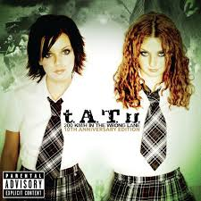
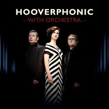

<p align="center">

<br></br>
</p>

<p align="center">
   <i><strong>An Interactive command line interface for wishing your facebook friends!</strong></i>
<p>

---

### <p align="center"> [About](#about) **|** [To Get Started](#to-get-started) **|** [Installation](#installation) **|** [Commands](#commands) </p>

## About

Facebook-Birthday-CLI is an interactive command line interface which helps in wishing your facebook friends and automate the wishes for you so that you never miss your friends birthday's.


## Why the hell should I use this?

IMHO you shouldn't! yes you read that right.
If you are one of the following peeps then you should give it a try!

* I am an automation geek!
* I am a developer and I like to explore and use interesting tech.
* I am a tech enthusiast and I want to wish my friends in an innovative way.
* I am just a lazy programmer but I do care about wishing my friends.
* I am neo, just swallowed the red pill & want to stay in the wonderland to see how deep the rabbit hole goes :)

**Note:** This project was started 2 years back as a fun project when I started learning automation. Due to work & personal commitments I could never finish it so now I got sometime and gave it the closure it needed!

## To Get Started

#### Pre-requisites
Just Download & Install [NodeJS](https://nodejs.org/en/download/) globally in your system.


## Installation

Let's start by installing facebook-birthday-cli globally with [npm](https://www.npmjs.com/) (It comes with nodejs installation, so you don't have to do anything :)). Just type the below commands in your command prompt/terminal.

```sh
$ npm install --global facebook-birthday-cli
```
## Commands

A global binary **facebook** will be installed, currently it supports a command - **wish** which when invoked starts the interactive CLI.

### Select the friend you wanna wish

Just run the below command: 

```sh
$ facebook wish
```
It starts the Interactive CLI , you would have to enter your credentials first which are encrypted and saved after first login so that you would not have to re-enter the credentials.

 After successfull login, you will see all your friends birthday's on the command line interface.

### Wish all your friends

Just run the below command: 

```sh
$ facebook wish --all
```

### Reset option to default settings

```sh
$ facebook wish --reset
```
```sh
$ facebook wish --all --reset
```
The `--reset` option resets all saved values to default values. i.e. You would have to enter your credentials again and follow the process without any saved configuration.

## Tech Stack

* [Node](https://nodejs.org/en/): Node.js is a JavaScript runtime built on Chrome's V8 JavaScript engine.
* [Puppeteer](https://pptr.dev/): Puppeteer is a Node library which provides a high-level API to control Chrome or Chromium over the DevTools Protocol. Puppeteer runs headless by default, but can be configured to run full (non-headless) Chrome or Chromium
* [TypeScript](https://www.typescriptlang.org/): The popular super-set & transpiler of JavaScript which adds static typing & features to it. This project is entirely written using typescript.
* [Inquirer](https://github.com/SBoudrias/Inquirer.js): It provides an awesome interface for making your command line interactive.
* [Commander](https://github.com/tj/commander.js): One of the popular node command line interface that helps write cli’s with ease.

## How it works?

The key tech which drives this tool is **Puppeteer** - An popular alternative to selenium these days! 

* When the command `facebook wish` is invoked , Inquirer cli starts asking list of questions and then processess the answers asynchronously.
* Puppeteer opens up the chrome browser in headless mode(In background, user would not see this happening visually) and logs into facebook events page where all the birthday events would be listed. 
* Puppeteer has similar API methods as that of selenium to interact with web elements such as - `click()`, `waitForSelector()`, `title()` etc.
* The user credentials  are encrypted and stored in the user's system after the first time login and then everytime this tool is invoked the user credentials are fetched from that location & decrypted to login.
* The web elements like total number of birthdays, birthday names and text boxes are identified with the help of puppeteer. These locators are stored in a separate object/class so that if they change in future , they could be easily updated.
* The wishes are sent to the friends as puppeteer drives & identifies the web elements of the browser in headless mode. 

## Contributions

For contributors who want to improve this repo by contributing some code, reporting bugs, issues or improving documentation - PR's are highly welcome, please maintain the coding style , folder structure , detailed description of documentation and bugs/issues with examples if possible.

## Credits

### Title gif 

[Motion Garten](https://www.instagram.com/motiongarten/?hl=en) - Do checkout his instagram page!

### Music

 [<br/><sub><b>"Nas Ne Dogoniat"</br>t.A.T.u</b></sub>](https://www.youtube.com/watch?v=sZV9A_gJzQI)| [<br/><sub><b>"Halah"</br>Mazzy Star</b></sub>](https://www.youtube.com/watch?v=jzWYUomBpwg) | [<br/><sub><b>"Mad About You"</br>Hooverphonic</b></sub>](https://www.youtube.com/watch?v=xVKGXgHDMvQ) | [<br/><sub><b>"Here comes rain"</br>Eurythmics</b></sub>](https://www.youtube.com/watch?v=TzFnYcIqj6I) | [<br /><sub><b>"The Logical Song"</br>Supertramp</b></sub>](https://www.youtube.com/watch?v=ukKQw578Lm8)
| :---: | :---: | :---: | :---: | :---: |


## License
```   
MIT License

Copyright (c) 2018 Ram Pasala
```